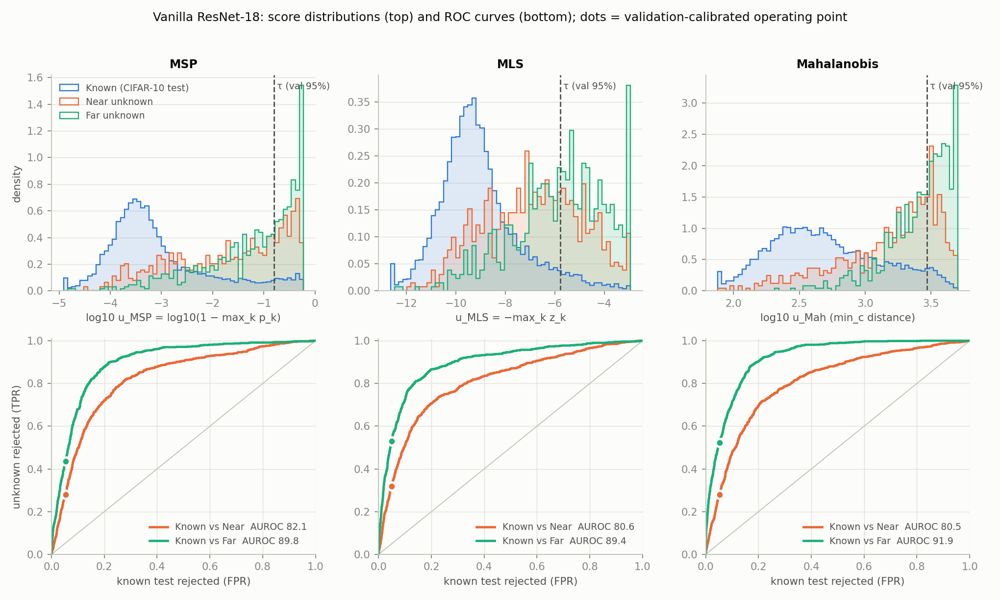

# Task 4 – Open-Set Recognition: results summary

_Auto-generated by `evaluate_osr.py`. Numbers are computed from the frozen caches; the interpretation is yours to write. Thresholds were fixed on CIFAR-10 validation data before any CIFAR-100 image was scored (`thresholds.json`)._

## Closed-set accuracy (CIFAR-10 test, 10 known logits)

- Vanilla: **94.82 %**
- GCSC: **94.96 %**
- PROSER: **94.19 %**

### Table 1 – Post-hoc scores on the frozen Vanilla model

| Score | AUROC Near (%) | AUROC Far (%) | AUROC All (%) | τ (val 95th pct) | Test accept (%) | Near reject (%) | Far reject (%) | All reject (%) | FPR@95 Near (%) | FPR@95 Far (%) | FPR@95 All (%) |
|---|---|---|---|---|---|---|---|---|---|---|---|
| MSP | 82.10 | 89.76 | 85.93 | 0.1583 | 94.62 | 27.88 | 43.62 | 35.75 | 72.12 | 56.38 | 64.25 |
| MLS | 80.64 | 89.40 | 85.02 | -5.78 | 95.11 | 31.87 | 53.00 | 42.44 | 68.12 | 47.00 | 57.56 |
| Energy | 80.67 | 89.44 | 85.05 | -5.968 | 95.29 | 33.00 | 54.37 | 43.69 | 67.00 | 45.62 | 56.31 |
| Mahalanobis | 80.54 | 91.89 | 86.21 | 2929 | 94.79 | 28.00 | 52.25 | 40.12 | 72.00 | 47.75 | 59.88 |

### Table 2 – Trained-model comparison (MLS common score + PROSER placeholder score)

| Model | Score | CSA (%) | AUROC Near (%) | AUROC Far (%) | AUROC All (%) | τ (val 95th pct) | Test accept (%) | Near reject (%) | Far reject (%) | All reject (%) | FPR@95 Near (%) | FPR@95 Far (%) | FPR@95 All (%) |
|---|---|---|---|---|---|---|---|---|---|---|---|---|---|
| Vanilla | MLS | 94.82 | 80.64 | 89.40 | 85.02 | -5.78 | 95.11 | 31.87 | 53.00 | 42.44 | 68.12 | 47.00 | 57.56 |
| GCSC | MLS | 94.96 | 81.44 | 89.77 | 85.60 | -5.989 | 95.32 | 32.50 | 55.50 | 44.00 | 67.50 | 44.50 | 56.00 |
| PROSER | MLS | 94.19 | 79.81 | 89.64 | 84.72 | -4.826 | 95.37 | 27.62 | 46.75 | 37.19 | 72.38 | 53.25 | 62.81 |
| PROSER | PROSER dummy (placeholder) | 94.19 | 79.33 | 88.51 | 83.92 | 0.6307 | 95.54 | 29.00 | 45.38 | 37.19 | 71.00 | 54.62 | 62.81 |
| PROSER | PROSER dummy margin (bias-calibrated) | 94.19 | 79.31 | 88.44 | 83.87 | 0.7621 | 95.44 | 29.12 | 46.00 | 37.56 | 70.88 | 54.00 | 62.44 |

## RQ1 – Semantic similarity (Vanilla + MLS threshold)

| Group | Unknown class | Accept rate (%) | Top absorbing CIFAR-10 label | Share of accepted (%) |
|---|---|---|---|---|
| near | pickup_truck | 89.00 | automobile | 71.91 |
| near | bus | 86.00 | truck | 79.07 |
| near | wolf | 78.00 | cat | 46.15 |
| near | fox | 70.00 | cat | 42.86 |
| near | leopard | 70.00 | cat | 41.43 |
| near | camel | 62.00 | horse | 30.65 |
| near | tractor | 54.00 | truck | 88.89 |
| near | motorcycle | 36.00 | automobile | 44.44 |
| far | wardrobe | 68.00 | truck | 51.47 |
| far | sunflower | 52.00 | bird | 42.31 |
| far | chair | 48.00 | airplane | 60.42 |
| far | bowl | 47.00 | cat | 23.40 |
| far | mushroom | 46.00 | bird | 60.87 |
| far | clock | 45.00 | ship | 31.11 |
| far | bottle | 40.00 | cat | 35.00 |
| far | keyboard | 30.00 | airplane | 33.33 |

Failure gallery (τ = -5.7804): `failures_vanilla_mls.png`, details in `failures_vanilla_mls.csv` (fill the `your_judgement` column after looking at the images).

| Group | Unknown class | Predicted | u | τ | a-priori label |
|---|---|---|---|---|---|
| near | camel | deer | -11.8901 | -5.7804 | plausible |
| near | pickup_truck | automobile | -11.6742 | -5.7804 | plausible |
| near | fox | dog | -11.6725 | -5.7804 | plausible |
| near | bus | truck | -11.3531 | -5.7804 | plausible |
| near | tractor | ship | -10.5467 | -5.7804 | surprising |
| near | wolf | dog | -10.5049 | -5.7804 | plausible |
| near | leopard | frog | -10.0136 | -5.7804 | surprising |
| near | motorcycle | automobile | -9.5679 | -5.7804 | plausible |
| far | mushroom | bird | -12.3700 | -5.7804 | surprising |
| far | keyboard | bird | -12.2381 | -5.7804 | surprising |
| far | bottle | cat | -11.5272 | -5.7804 | surprising |
| far | bowl | cat | -10.9456 | -5.7804 | surprising |
| far | clock | cat | -10.6225 | -5.7804 | surprising |
| far | sunflower | bird | -10.5634 | -5.7804 | surprising |
| far | wardrobe | truck | -9.8680 | -5.7804 | surprising |
| far | chair | airplane | -9.5349 | -5.7804 | surprising |

## RQ2 – What each post-hoc score captures (Vanilla)

Spearman rank correlation of u(x):

| Pair | Known test + unknowns | Known test only | Unknowns only |
|---|---|---|---|
| MSP vs MLS | 0.960 | 0.951 | 0.915 |
| MSP vs Energy | 0.958 | 0.950 | 0.884 |
| MSP vs Mahalanobis | 0.696 | 0.569 | 0.922 |
| MLS vs Energy | 1.000 | 1.000 | 0.996 |
| MLS vs Mahalanobis | 0.586 | 0.429 | 0.819 |
| Energy vs Mahalanobis | 0.584 | 0.427 | 0.789 |

Decision disagreement on unknowns at each score's own validation threshold (% of the group rejected by one score but not the other):

| Pair | Group | Only A rejects | Only B rejects | Both reject |
|---|---|---|---|---|
| A=MSP, B=MLS | near | 4.38 | 8.38 | 23.50 |
| A=MSP, B=MLS | far | 5.00 | 14.37 | 38.62 |
| A=MSP, B=Energy | near | 5.25 | 10.38 | 22.62 |
| A=MSP, B=Energy | far | 5.62 | 16.38 | 38.00 |
| A=MSP, B=Mahalanobis | near | 3.75 | 3.88 | 24.12 |
| A=MSP, B=Mahalanobis | far | 2.75 | 11.38 | 40.88 |
| A=MLS, B=Energy | near | 0.88 | 2.00 | 31.00 |
| A=MLS, B=Energy | far | 0.62 | 2.00 | 52.38 |
| A=MLS, B=Mahalanobis | near | 9.38 | 5.50 | 22.50 |
| A=MLS, B=Mahalanobis | far | 10.75 | 10.00 | 42.25 |
| A=Energy, B=Mahalanobis | near | 11.12 | 6.12 | 21.88 |
| A=Energy, B=Mahalanobis | far | 12.50 | 10.38 | 41.88 |

## RQ3 / RQ4 – Deltas relative to Vanilla + MLS (percentage points)

| Model / score | ΔCSA | ΔAUROC Near | ΔAUROC Far | ΔNear reject | ΔFar reject |
|---|---|---|---|---|---|
| GCSC + MLS | +0.14 | +0.80 | +0.37 | +0.62 | +2.50 |
| PROSER + MLS | -0.63 | -0.83 | +0.24 | -4.25 | -6.25 |
| PROSER + PROSER dummy (placeholder) | -0.63 | -1.31 | -0.89 | -2.87 | -7.63 |
| PROSER + PROSER dummy margin (bias-calibrated) | -0.63 | -1.33 | -0.97 | -2.75 | -7.00 |

PROSER (placeholder score) vs GCSC (MLS): ΔCSA -0.77, ΔAUROC near -2.11, ΔAUROC far -1.26.

## Questions to answer in the report

1. How does semantic similarity affect rejection? Which near/far classes are most often accepted, which CIFAR-10 labels absorb them, which failures are semantically plausible?
2. What do MSP, MLS, Energy and Mahalanobis each capture? Use their agreements/disagreements.
3. Does GCSC's RandAugment improve CSA, OSR, both or neither? Why do near and far differ?
4. Does PROSER improve rejection beyond Vanilla and GCSC, at what CSA cost? Where is interpolation between known classes insufficient?
